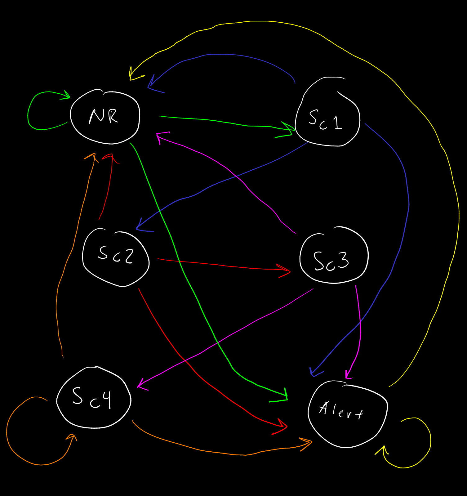
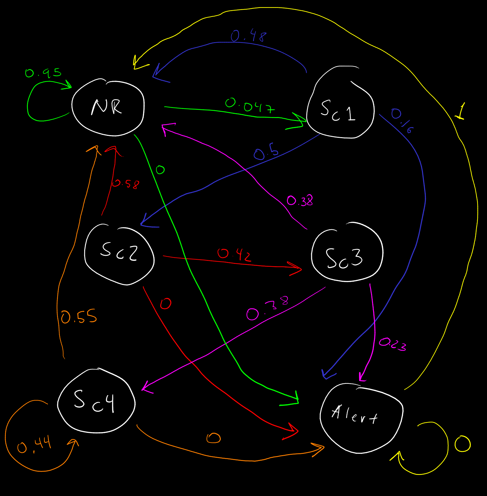

```{r, echo = FALSE}
knitr::opts_chunk$set(
  collapse = TRUE,
  comment = "#>",
  fig.path = "./figures/"
)
```

Importing libraries

```{r, echo=TRUE, warning=FALSE}
library(markovchain)
library(matlib)
```

Functions to solve the problems

```{r, echo=TRUE, warning=FALSE}
matrixpower <- function(M,k) {
  if(dim(M)[1]!=dim(M)[2]) return(print("Error: matrix M is not square"))
  if (k == 0) return(diag(dim(M)[1])) 
  if (k == 1) return(M)
  if (k > 1)  return(M %*% matrixpower(M, k-1))
}
```

# Problem 1

## a)

Markov chain criteria:

1- The probability of being in a state only depends on the previous state.

2- It's a stochastic process.

$X$ = The chain hits state $j$ at time $n$

$X_{n}$ is the scenario at time $n$

All states have finite expected return times and there is only a single communication class so the MC is irreducible, therefore its stationary distribution is **unique**.



\newpage

## b)

We have first calculated the relative frequencies manually.

```{r, echo=TRUE, warning=FALSE}
load('PollutionMadrid.RData')
data <-  X[1,]
mat <- matrix(rep(0,36), nrow=6, byrow=T)
for (i in 1:length(data)) {
  if (data[i] == "Alert") {
    data[i] = 1
  } else if (data[i] == "NR") {
    data[i] = 2
  } else if (data[i] == "Sc1") {
    data[i] = 3
  } else if (data[i] == "Sc2") {
    data[i] = 4 
  } else if (data[i] == "Sc3") {
    data[i] = 5
  } else if (data[i] == "Sc4") {
    data[i] = 6
  }
}
data <- as.numeric(data)
for (i in 1:length(data)) {
  mat[data[i],data[i+1]] = mat[data[i],data[i+1]] + 1
}
mat[data[1460],data[1]] = mat[data[1460],data[1]] + 1

tbl <- table(data)
for (i in 1:length(tbl)) {
  mat[i,] = mat[i,]/tbl[i]
}
mat
```

\newpage

We then tested using the *markovchain* package in order to confirm our results.

```{r, echo=TRUE, warning=FALSE}
data <- X[1,]
markovchainFit(data)$estimate
```

&nbsp;

### What can you say of the comparison of your estimates andthe possible transitions between states that you had argued in part a

According to our probabilities shown in the graph. There are 3 arrows with probability 0. This is due to the fact that in the data there are zero transitions from $Sc2 \rightarrow Alert$, $Sc4 \rightarrow Alert$, $NR \rightarrow Alert$, $Alert \rightarrow Alert$.

This is logical given that it is very unlikely to hit an alert state. Unlike the rest of the states.

Later it will be shown that there's a unique stationary distribution (see 1d).



\newpage

## c)

Given that the first state of the chain is NR. We see the following 7 states:

```{r, echo=TRUE, warning=FALSE}
data[1:7]
```

And we calculate the probability as follows:

```{r, echo=TRUE, warning=FALSE}
mat[2,2]^7
```

We can see the probability is 0.713843

## d)

We can see that because we have a unique solution to the system, we have a unique stationary distribution.

```{r, echo=TRUE, warning=FALSE}
stationary_dist <- function(P) {
    dim = sqrt(length(P))
    A = P - diag(dim)
    b = matrix(c(1,rep(0,dim-1)),nrow=dim,byrow=T)
    A[,1] <- rep(1,dim)
    print("The solution is the following:")
    return(matlib::Solve(t(A), b))
}
stat_dist <- stationary_dist(mat)
stat_dist
```

This is our stationary distribution:

$\pi_{1} = 0.00273973$

$\pi_{2} = 0.91780822$

$\pi_{3} = 0.04315068$

$\pi_{4} = 0.02123288$

$\pi_{5} = 0.00890411$

$\pi_{6} = 0.00616438$

\newpage

Comparing with the proportions we get from our data:

```{r, echo=TRUE, warning=FALSE}
rel_error = c()
props = table(data)/length(data)
results <- c(0.00273973,0.91780822,0.04315068,0.02123288,0.00890411,0.00616438)
for (i in 1:length(props)) {
    rel_error[i] <- abs(props[i]-results[i])/results[i]
}
rel_error
```

We can see our relative errors are all quite low (<$1*10^{-5}$) so we could say that the difference between both estimations is nearly negligible. 

## e)

### Proof that this MC has a limiting distribution

We have previously proven that this MC is irreducible. Now we want to prove that this MC is also aperiodic.

We can easily prove this by checking the paths from NR to the nodes it's connected with:

1st path: 3 steps: $NR \rightarrow Sc1 \rightarrow Sc2 \rightarrow NR)$

2nd path: 2 steps: $NR \rightarrow Sc1 \rightarrow NR)$

$\dots$

Because the $\{3,2,...\}$ and 2 elements of this set are prime numbers, the greatest common divisor of this set is always going to be 1.

This applies for all the other nodes as they all belong to the same class.

Therefore this chain has a **unique** stationary distribution which coincides with its limiting distribution.

### What does this mean, in terms of pollution episodes?

The proportion of pollution episodes depends on our limiting distribution, i.e. the long run proportion of pollution episodes with Scenario 1 will be the value of Sc1 in our limiting distribution. If we look ahead in the future, and we want to know the probability of being in a specific pollution episode scenario, $p_{ij}$ is the probability of being in scenario $j$.

Taking the a high power of our transition matrix we get the following limiting distribution:

```{r, echo=TRUE, warning=FALSE}
mp <- matrixpower(mat,120)
mp
```

\newpage

## f)

If we take the sum of the probability of scenarios 3, 4 and Alert: $P(Sc3) + P(Sc4) + P(Alert)$ multiplied by the amount of days in a year, we get the amount of days in a year with such driving restriction:

```{r, echo=TRUE, warning=FALSE}
365*(mp[1,1]+mp[1,5]+mp[1,6])
```

We get that the amount of days where driving is forbidden is 6.5 days. Approximately a week.

\newpage

# Problem 2

## a)

We set up the following system of equations:

$\sum_{i=0} \pi_{i} P_{i,0}  = \pi_{1}$

$\sum_{i=1} \pi_{i} = 1$

$(1 - p) \pi_{1} = \pi_{2}$
$\dots$
$(1 - p) \pi_{n-2} = \pi_{n-1}$
$\dots$

For the first equation, each $P_{i,0} = p$, therefore:

$\sum_{i=0} P_{i,0} \pi_{i} = \pi_{1} \Rightarrow p \sum_{i=1} \pi_{i} = \pi_{1}$

$p = \pi_{1}$

$(1 - p)p = \pi_{2}$
$(1 - p)^{2} p = \pi_{3}$
$\dots$
$(1 - p)^{n-1} p = \pi_{n}$
$\dots$

Then, we get:


Because our MC is an irreducible infinite state MC, we have a unique stationary distribution $\pi$, $\pi_{i} = \frac{1}{\mu_{i}}$ and not all states have expected finite return times then we have:

$E[T_{i}|X_{0} = i] = \mu_{i} = \frac{1}{\pi_{i}}$

## b)

As it is aperiodic and irreducible MC it has a limiting distribution.

## c)

We define the following function to simulate $n$ steps with initial value $p$.

```{r, echo=TRUE, warning=FALSE}
sim <-function(x0,n,p){ 
    n <- n-2
    x = rep(0,n)
    for (i in 1:n) {
        u=runif(1) 
        if (u <= p) {
            x[i+1] = x[i] + 1
        } else {
            x[i+1] = 0
        }
    } 
    return(c(x0,x))
}
```

&nbsp;

We simulate $n=30$ steps to test the function with initial value $x_{0} = 100$ and $p=0.95$:

```{r, echo=TRUE, warning=FALSE}
sim(100,30,0.95)
```

## d)

We generate 8 trajectories of length 1000 with different intiial values between [100,1000]

```{r, echo=TRUE, warning=FALSE, results='hide'}
initial_x = sample((100:1000), 8)
trajs = matrix(rep(0,8*1000),nrow=1000,byrow=T)
for (i in 1:8) {
    trajs[,i] <- sim(initial_x[i], 1000, 1/2)
}
```

```{r, echo=TRUE, warning=FALSE}
par(mfrow=c(4,2), mar=c(1,1,1,1))
for (i in 1:8) {
    plot(trajs[,i], ylim=c(0,1001))
}
```

The limiting distribution of this chain does not really depend at all on the first value. As such initial value could be a high number (between 100-1000), given that the probability corresponding to our group number ($k=1$) produces a very high $p=\frac{1}{1+k} = \frac{1}{2}$, therefore the chain drops very quickly to 0 and remains there without climbing values very much.

Our maximums per simulation are always the initial value:

```{r, echo=TRUE, warning=FALSE}
maximums = c()
for (i in 1:8) {
    maximums[i] = max(trajs[,i])
}
maximums
```

While the second highest values will be the followings:

```{r, echo=TRUE, warning=FALSE}
maximums = c()
for (i in 1:8) {
    maximums[i] = max(trajs[,i][2:1000])
}
maximums
```

Which are all significantly lower than our initial values.